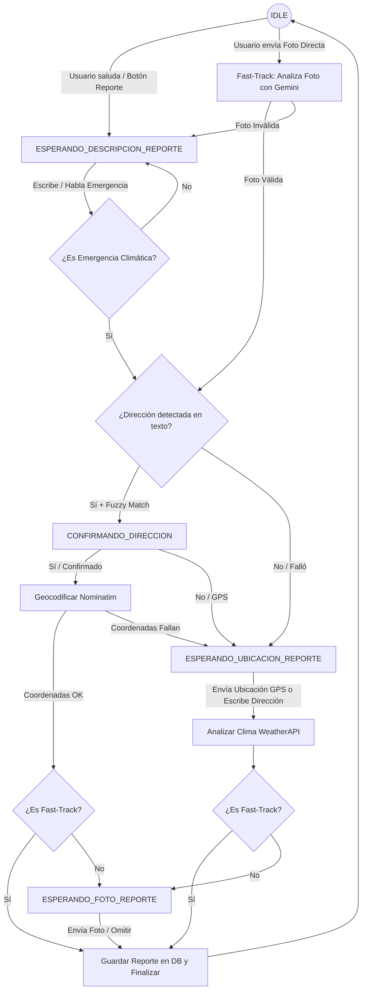

# Diagrama de Flujos y Estados del Bot (Inú)

Este documento detalla el comportamiento del bot (WhatsApp / Telegram) auditado directamente desde la implementación del backend en TypeScript (`state_machine.ts`). Su propósito es servir de guía técnica clara para el equipo de desarrollo.

---

## 1. El Core: La Máquina de Estados

El bot mantiene una conversación guiada guardando el estado del usuario mediante su `chatId` en la tabla `user_sessions`.
Si el usuario permanece inactivo por más de **1 hora**, la sesión expira y vuelve automáticamente al estado `IDLE` (Salida limpia para evitar bloqueos).

### Los 6 Estados Posibles:

1. **`IDLE`**: Estado de reposo. Espera comando/saludo inicial o una foto directa (Fast-Track).
2. **`ESPERANDO_DESCRIPCION_REPORTE`**: Espera que el usuario explique por escrito o audio qué está pasando.
3. **`CONFIRMANDO_DIRECCION`**: El bot detectó una dirección por IA y le pide al usuario confirmar ("Sí" / "No") antes de buscar coordenadas.
4. **`ESPERANDO_UBICACION_REPORTE`**: Espera un Pin GPS (Ubicación de chat) o la dirección escrita manualmente si falló la detección anterior.
5. **`ESPERANDO_FOTO_REPORTE`**: Espera que el usuario suba una foto del desastre o escriba "omitir".
6. **`ESPERANDO_UBICACION_CONSULTA`**: Espera un Pin GPS para devolver reportes cercanos y acumulado de lluvia.

---

## 2. Flujo Completo de Reporte (🚨 Enviar Reporte)

El bot maneja dos caminos para reportar un incidente climático: el **Flujo Convencional** (iniciado con texto o tocando el botón de Reporte) y el **Flujo Fast-Track** (iniciado mandando una foto directamente).

---

## 3. Detalle de los Caminos y Decisiones del Backend

### Camino A: Flujo Convencional (Paso a Paso)

1. **Estado `IDLE`**: El usuario escribe "hola" o presiona "🚨 Enviar Reporte". El bot pasa a `ESPERANDO_DESCRIPCION_REPORTE`.
2. **Estado `ESPERANDO_DESCRIPCION_REPORTE`**:
   - El usuario envía texto o nota de voz (transcripta automáticamente por **Whisper**).
   - Se valida con la LLM (`validateDescription`) si el contenido es una emergencia climática válida (calle anegada, árboles caídos, granizo, etc.). Si no lo es, se advierte y se queda en este estado.
   - Si es válido, la LLM (`extractAddress`) intenta extraer la calle cruda del mensaje.
   - La calle se procesa a través del algoritmo **Fuzzy Matching** (Levenshtein + Desempate por prefijos).
     - **Si se detecta dirección:** Pasa a `CONFIRMANDO_DIRECCION`.
     - **Si NO se detecta:** Pasa a `ESPERANDO_UBICACION_REPORTE` solicitando GPS.
3. **Estado `CONFIRMANDO_DIRECCION`**:
   - Si el usuario dice **Sí**: Se consulta Nominatim (Geocodificación) para hallar latitud y longitud.
     - Si Nominatim tiene éxito, se registra y se pasa a `ESPERANDO_FOTO_REPORTE` (con la ubicación ya fija).
     - Si falla, pasa a `ESPERANDO_UBICACION_REPORTE`.
   - Si el usuario dice **No / GPS**: Pasa a `ESPERANDO_UBICACION_REPORTE` pidiendo el Pin de mapa.
4. **Estado `ESPERANDO_UBICACION_REPORTE`**:
   - El usuario envía su Pin GPS o escribe la dirección manualmente.
   - Si falla al escribir la dirección 3 veces, el reporte se cancela automáticamente por seguridad.
   - Al recibir la coordenada, el bot consulta **WeatherAPI** para registrar cuánta lluvia acumulada (`precip_mm`) hubo en la zona en las últimas 24h.
   - Pasa a `ESPERANDO_FOTO_REPORTE`.
5. **Estado `ESPERANDO_FOTO_REPORTE`**:
   - El usuario envía una foto o escribe _"omitir"_.
   - Si envía una foto, la IA (Gemini/Groq) la analiza. El bot contesta explícitamente con `✅ La imagen fue procesada...` o `⚠️ La imagen no parece...`. Si es válida, suma +5 puntos.
   - Se calcula el Scoring final del reporte.
   - Se persiste el reporte (`saveReport`) y se obtiene su UUID. El bot responde con un enlace interactivo al mapa (`MAP_BASE_URL` + UUID) y las pautas de seguridad. La sesión vuelve a `IDLE`.

---

### Camino B: El "Fast-Track" (Foto al Inicio)

Este camino optimiza la experiencia del usuario cuando este prefiere mandar directamente la foto del desastre en frío.

1. **Estado `IDLE`**: El usuario envía una foto directamente.
2. **Análisis Inmediato**:
   - El bot analiza la foto con Gemini.
   - **Si la foto NO es válida:** Le avisa al usuario y le pide una descripción por texto, moviéndolo a `ESPERANDO_DESCRIPCION_REPORTE`.
   - **Si la foto SÍ es válida (Fast-Track activado):**
     - **Eager Upload:** Se sube la foto inmediatamente al Storage de Supabase para evitar pérdidas de sesión.
     - Se valida que es una emergencia y se le extrae la calle mediante la descripción visual de la IA.
     - El bot salta directamente a `CONFIRMANDO_DIRECCION` (ahorrándole al usuario tener que escribir lo que pasa).
3. **Guardado Directo**:
   - Una vez confirmada la ubicación (sea por confirmación de la calle de la foto o por envío de Pin GPS posterior), el bot **guarda el reporte directamente**, sin volver a pedir la foto al final porque ya cuenta con ella.

---

## 4. Flujo de Consulta de Zona (📍 Estado de mi zona)

Un flujo ágil diseñado para que los vecinos conozcan el estado de alerta a su alrededor.

1. **Estado `IDLE`**: El usuario presiona "📍 Estado de mi zona". La sesión pasa a `ESPERANDO_UBICACION_CONSULTA`.
2. **Estado `ESPERANDO_UBICACION_CONSULTA`**:
   - El bot solicita el Pin GPS. (Límite de 3 intentos fallidos antes de cancelar).
   - Recibe la coordenada.
   - **Fórmula de Haversine local:** El bot calcula matemáticamente la distancia de todos los reportes activos en la base de datos en las últimas 24 horas y cuenta cuántos de ellos caen en un radio de **2 kilómetros** a la redonda de la ubicación del usuario.
   - Consulta los milímetros de lluvia acumulada en esa coordenada mediante WeatherAPI.
   - Le responde al usuario: _"Hay X reportes activos cerca tuyo y cayeron Y mm de lluvia."_
   - La sesión vuelve a `IDLE`.

---

## 5. Decisiones de Arquitectura e Infraestructura Críticas

_(Para que los desarrolladores NO alteren este comportamiento en futuros commits)_

- **Eager Upload de Imágenes:** La API REST de Supabase bloquea payloads mayores a 1MB. Al enviar Base64 pesado, la sesión no se guardaba y se rompía el bot. La solución fue subir la foto a Storage apenas se valida y guardar solo la URL de 80 bytes en la sesión temporal.
- **Uso de Deno Std Base64:** Para decodificar la foto, en Deno Edge Functions se utiliza la librería estándar nativa (`import { decode } from "std/encoding/base64.ts"`), evitando loops manuales de JavaScript que colgaban la CPU de Supabase y devolvían Timeout.
- **Fallback Visual Avanzado (Gemini + Groq):** Priorizamos `gemini-3.5-flash`. Si la cuota se excede (429), usamos `gemini-3.5-flash-lite` (corregido el error de `thinkingBudget`). Si todos fallan, el sistema realiza fallback a `llama-3.2-90b-vision-preview` en Groq, garantizando 24/7 de alta disponibilidad visual.
- **Feedback de UX y Redirección (`MAP_BASE_URL`):** Tras insertar la alerta, la base de datos retorna el UUID. El bot lo concatena a `MAP_BASE_URL` y brinda al ciudadano un link cliqueable para monitorear su propio reporte desde el Frontend. También se transparenta la validación de la foto con respuestas de emoji (✅ / ⚠️) durante el proceso.
